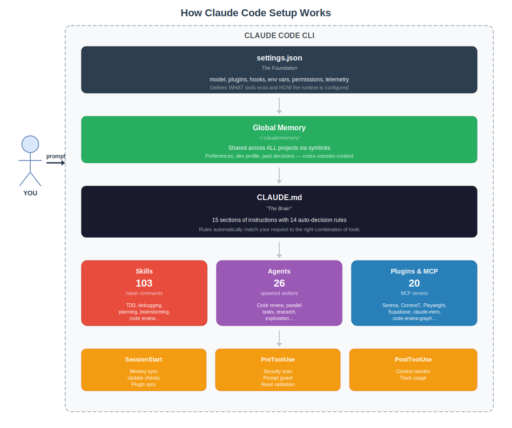

# Claude Code Setup

My full Claude Code configuration — agents, skills, hooks, plugins, and global instructions.

## How It Works



Interactive diagram: [docs/architecture.drawio](docs/architecture.drawio) (open in [diagrams.net](https://app.diagrams.net/)).

## What's Included

| Component | Count | Description |
|-----------|-------|-------------|
| **CLAUDE.md** | 1 | Global instructions (15 sections, 14 auto-decision rules) |
| **Agents** | 21 | Specialized agent definitions (GSD framework) |
| **Standalone Skills** | 62 | Slash commands (59 GSD + 3 other) |
| **Plugin Skills** | 34 | Skills bundled inside 6 plugins |
| **Plugin Commands** | 7 | Commands bundled inside 3 plugins |
| **Plugin Agents** | 5 | Agent definitions bundled inside 4 plugins |
| **Total Slash Commands** | **103** | All available slash commands (62 + 34 + 7) |
| **Hooks** | 8 | Lifecycle automation (SessionStart, PreToolUse, PostToolUse) |
| **Plugins & MCP** | 20 (19 plugins + 1 standalone MCP) | Serena, Context7, Playwright, Codex, code-review-graph, etc. |

## Quick Install

```bash
git clone https://github.com/tomascortereal/claude-code-setup.git
cd claude-code-setup
./install.sh
```

Then edit `~/.claude/settings.json` to fill in your personal values (API URL, OTEL endpoint, etc.).

## Plugins

### Official (claude-plugins-official) — 12 plugins
| Plugin | Description |
|--------|-------------|
| **serena** | Semantic code navigation (LSP-based symbols, references, edits) |
| **context7** | Live library/framework documentation |
| **playwright** | Browser automation (navigate, click, screenshot, snapshot) |
| **superpowers** (v5.0.7) | Brainstorming, TDD, debugging, parallel agents, code review, plans (14 skills) |
| **code-simplifier** | Code quality review agent |
| **ralph-loop** | Recurring task loops |
| **typescript-lsp** | TypeScript language server |
| **pyright-lsp** | Python language server |
| **supabase** | Database/auth/storage/edge functions |
| **agent-sdk-dev** | Claude Agent SDK scaffolding |
| **claude-code-setup** | Automation recommender |
| **greptile** | Codebase intelligence (disabled by default) |

### Third-Party — 3 plugins
| Plugin | Source | Description |
|--------|--------|-------------|
| **ui-ux-pro-max** (v2.0.1) | [nextlevelbuilder/ui-ux-pro-max-skill](https://github.com/nextlevelbuilder/ui-ux-pro-max-skill) | 50+ styles, 161 palettes, 99 UX guidelines (7 skills) |
| **claude-mem** (v10.5.5) | [thedotmack/claude-mem](https://github.com/thedotmack/claude-mem) | Persistent cross-session memory (4 skills) |
| **arize-skills** (v0.1.0) | [Arize-ai/arize-skills](https://github.com/Arize-ai/arize-skills) | LLM observability, tracing, experiments (6 skills) |

### OpenAI ([openai/codex-plugin-cc](https://github.com/openai/codex-plugin-cc)) — 1 plugin
| Plugin | Description |
|--------|-------------|
| **codex** | Codex code review, adversarial review, task delegation (2 skills, 1 agent) |

### LSPs ([Piebald-AI/claude-code-lsps](https://github.com/Piebald-AI/claude-code-lsps)) — 3 plugins
| Plugin | Description |
|--------|-------------|
| **pyright** (v0.1.0) | Python type checking |
| **basedpyright** (v0.1.0) | Enhanced Python type checking |
| **vtsls** (v0.1.0) | TypeScript/JavaScript (disabled by default) |

## MCP Servers

Standalone MCP servers configured globally via `~/.claude/.mcp.json` (not part of the plugin system):

| Server | Source | Description |
|--------|--------|-------------|
| **code-review-graph** | [tirth8205/code-review-graph](https://github.com/tirth8205/code-review-graph) | Knowledge graph for code review — semantic search, impact analysis, change detection, architecture overview |

Install: `uvx code-review-graph serve` (runs via uvx, no global pip install needed).

## Standalone Skills (External)

Skills installed globally via pip/uvx (not part of the plugin system):

| Skill | Source | Description |
|-------|--------|-------------|
| **graphify** | [safishamsi/graphify](https://github.com/safishamsi/graphify) | Knowledge graph from code, docs, papers, images — architecture understanding, design rationale, 19 languages, multimodal |

Install: `uvx --from graphifyy graphify install` (auto-detects Claude Code, installs skill to `~/.claude/skills/graphify/`).

## Architecture

See [docs/ARCHITECTURE.md](docs/ARCHITECTURE.md) for the full directory tree, model config, hook details, and exact counts.

## Hooks

8 hook files, 6 wired in `settings.json`:

| Hook | Trigger | What it does |
|------|---------|-------------|
| `global-memory-symlink.sh` | SessionStart | Ensures all project memory dirs symlink to global `~/.claude/memory/` |
| `gsd-check-update.js` | SessionStart | Checks for GSD framework updates |
| `integration-sync.js` | SessionStart | Syncs plugin/MCP integrations |
| `gsd-context-monitor.js` | PostToolUse (Bash\|Edit\|Write\|Agent\|Task) | Monitors context window usage |
| `gsd-prompt-guard.js` | PreToolUse (Write\|Edit) | Guards against prompt injection |
| `gsd-read-guard.js` | PreToolUse (Write\|Edit) | Validates reads before edits |
| `gsd-workflow-guard.js` | _(not wired)_ | Workflow validation (available but not active) |
| `gsd-statusline.js` | _(not wired as hook)_ | Used by statusLine config, not a lifecycle hook |

## Global Memory

Memory is **global** (shared across all projects), not project-scoped. The `global-memory-symlink.sh` hook runs on every session start to ensure new projects automatically use the shared memory at `~/.claude/memory/`.

## Customization

After installing, you'll want to:

1. **`settings.json`** — Set your `ANTHROPIC_BASE_URL`, OTEL endpoint, and resource attributes
2. **`CLAUDE.md`** — Adjust the decision rules and tool preferences to match your workflow
3. **`memory/`** — Add your own memory files (communication preferences, dev profile, etc.)

See [docs/CUSTOMIZATION.md](docs/CUSTOMIZATION.md) for detailed guidance.

## Requirements

- [Claude Code CLI](https://docs.anthropic.com/en/docs/claude-code) installed
- Node.js 18+
- Git
